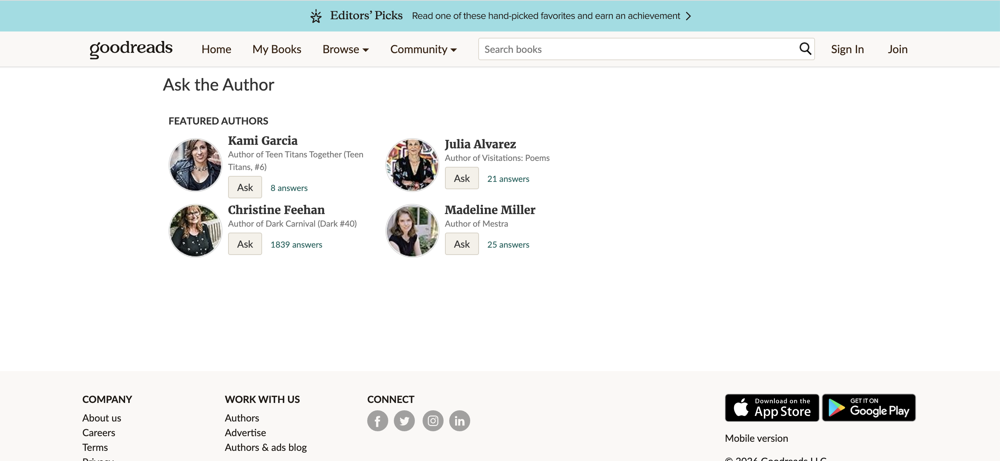
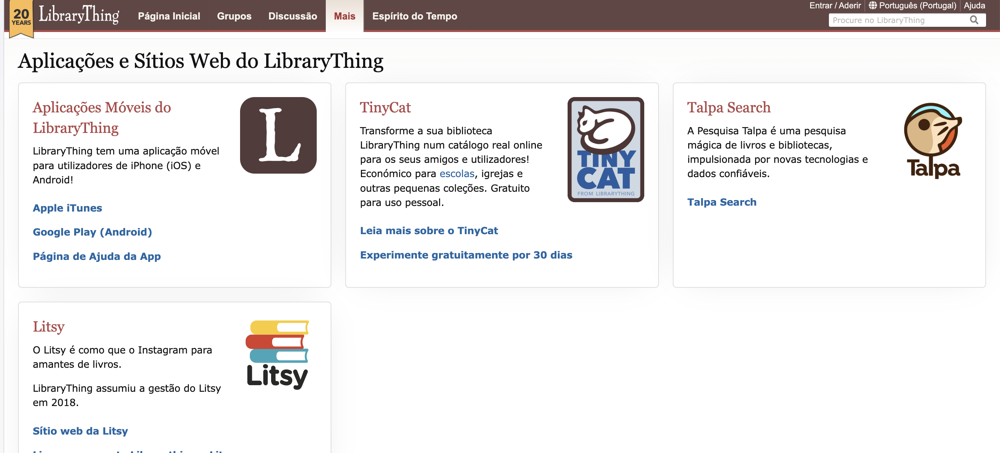
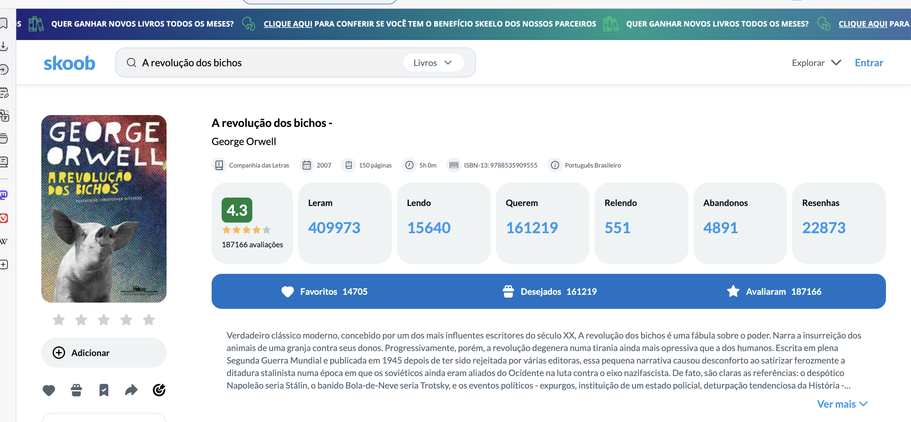

# MyBookshelf

**Licenciatura em Engenharia Informática | LEIF02 | 25-26**  
**UC:** Projeto de Desenvolvimento Web  
**Docente:** Maria Inês Pires   
**Grupo C** **Turma D02**

**Autores:**
- Gabriel Lima Rezende - 20240343  
- Dário Biaguê Bandanhe – 20241751  
- Edmilson Marcos Tudo – 20241542  
- Francisco Rocha Zolana – 20240801  

**Palavras Chave**
Livros, Leitura, Biblioteca, Livraria, Feira do Livro, Literatura

---

## Índice
- [Descrição da App](#descrição-da-app)
- [Requisitos Funcionais e Não Funcionais](#requisitos-funcionais-e-não-funcionais)
- [Objetivos e Motivação](#descrição-dos-objetivos-e-da-motivação-do-trabalho)
- [Público-Alvo](#identificação-de-público-alvo)
- [Pesquisa de Mercado](#pesquisa-de-mercado)
- [Solução a Implementar](#descrição-da-solução-a-implementar)
- [Conclusão](#conclusão)

---

## Relatório

Abaixo temos uma versão mais curta do nosso relatório. Para encontrar todas as etapas do projeto e todos os detalhes, acede ao documento em PDF no caminho abaixo:

📄 [Documentação - 3ª Entrega](https://github.com/Dario8724/MyBookshelf/tree/main/Documenta%C3%A7%C3%A3o/3%C2%AAEntrega)

---

## Descrição da Aplicação

O MyBookshelf é uma plataforma web desenvolvida pelo grupo, concebida como uma biblioteca digital pessoal e uma rede social literária, centrada na experiência colaborativa de leitura através de clubes de leitura.
A aplicação permite aos utilizadores registar os livros que já leram, os que estão a ler e os que pretendem ler, criando uma estante digital personalizada que reflete os seus gostos, interesses e percurso enquanto leitores.

A plataforma integra funcionalidades de acompanhamento do progresso de leitura, definição de metas e elementos de gamificação, como medalhas e conquistas, promovendo a motivação, a consistência e o desenvolvimento do hábito de leitura de forma contínua e envolvente.
Para além da dimensão individual, o MyBookshelf valoriza a componente social, permitindo a partilha de avaliações, reviews e opiniões, bem como a interação entre utilizadores numa comunidade digital centrada nos livros.

O elemento central da aplicação são os clubes de leitura, onde os utilizadores participam em leituras conjuntas, acompanham o progresso coletivo, partilham perspetivas e interagem com outros membros. Desta forma, o MyBookshelf transforma a leitura numa experiência mais dinâmica, participativa e colaborativa, combinando organização pessoal com uma forte vertente social.

---

## Requisitos Funcionais e Não Funcionais

### Requisitos Funcionais

- **Clubes de Leitura (Funcionalidade Principal)**
  - Criação e participação em clubes de leitura  
  - Biblioteca partilhada do clube  
  - Definição de leituras conjuntas  
  - Ranking de participação dos membros  
  - Listagem dos livros mais lidos no clube  
  - Visualização de clubes disponíveis  
 
- **Biblioteca Pessoal**
  - Organização de livros em categorias:
  - Lidos  
  - Em leitura  
  - Por ler  
  - Registo e gestão da estante digital  
  - Avaliação de livros  
  - Criação de reviews  

- **Livros**
  - Consulta de detalhes dos livros (autor, género, descrição)
  - Sistema de avaliação  
  - Visualização de reviews de outros utilizadores  

- **Feed Social**
  - Visualização de publicações dos utilizadores  
  - Partilha de leituras e opiniões  
  - Interação com publicações (gostos e comentários)
  
---

### Requisitos Não Funcionais

- **Usabilidade e experiência do utilizador**
  - Interface intuitiva e amigável  
  - Navegação simples e consistente  
  - Experiência centrada no utilizador  

- **Desempenho e fiabilidade**
  - Tempo de resposta adequado  
  - Disponibilidade do sistema  
  - Estabilidade da plataforma  

- **Segurança e privacidade**
  - Proteção de dados pessoais  
  - Segurança de autenticação  
  - Controlo de acessos e permissões  
  - Conformidade com princípios de privacidade  

- **Compatibilidade e acessibilidade**
  - Interface responsiva (desktop, tablet, mobile)  
  - Compatibilidade entre navegadores  

- **Escalabilidade e manutenção**
  - Arquitetura escalável  
  - Facilidade de manutenção  
  - Modularidade do sistema  

---

## Descrição dos Objetivos e da Motivação do Trabalho

A leitura desempenha um papel fundamental no desenvolvimento intelectual, emocional e social, contribuindo para o pensamento crítico, a criatividade e a aprendizagem contínua. No entanto, muitos leitores enfrentam dificuldades na organização das suas leituras, na manutenção de hábitos consistentes e, sobretudo, na partilha de experiências com outros leitores de forma estruturada.

O projeto MyBookshelf surge como resposta a estas necessidades, propondo uma plataforma digital centrada na criação e participação em clubes de leitura. Através destes clubes, os utilizadores podem acompanhar leituras conjuntas, partilhar opiniões, avaliar livros e interagir com outros membros, promovendo uma experiência de leitura mais colaborativa e envolvente.Paralelamente, a plataforma permite a organização de uma biblioteca digital pessoal, o acompanhamento do progresso de leitura e a definição de metas, integrando funcionalidades individuais com uma forte componente social. Desta forma, o MyBookshelf posiciona-se como uma solução que combina organização pessoal com interação comunitária, tendo os clubes de leitura como elemento central da experiência.

---

## Identificação de Público-Alvo

### Leitores
- **Idade:** 15–60 anos  
- **Localização:** Principalmente em Portugal (podendo estender-se a países lusófonos)  
- **Habilitações:** Ensino secundário e superior  
- **Características:** Interesse por literatura, leitura regular, procura de recomendações e novos autores  

### Estudantes
- **Idade:** 15–25 anos  
- **Localização:** Escolas e universidades em Portugal  
- **Habilitações:** Ensino secundário e ensino superior  
- **Características:** Utilizam a leitura para estudo, trabalhos académicos e desenvolvimento pessoal  

### Comunidade literária
- **Idade:** 18–65 anos  
- **Localização:** Nacional e internacional (especial foco em comunidades online)  
- **Habilitações:** Variável (muitos com formação em áreas de letras/comunicação)  
- **Características:** Inclui escritores, bloggers, críticos e participantes em eventos literários  

### Utilizadores digitais
- **Idade:** 15–45 anos  
- **Localização:** Predominantemente urbanos  
- **Habilitações:** Variável  
- **Características:** Familiaridade com tecnologia, uso frequente de plataformas digitais, consumo de conteúdos online  
---

## Pesquisa de Mercado

### Goodreads

Plataforma muito popular que permite aos utilizadores avaliar livros, criar listas, acompanhar leituras e ver o que os amigos estão a ler.

#### Pontos fortes
- Grande comunidade global  
- Sistema de avaliações e reviews muito ativo  
- Recomendações baseadas no histórico de leitura  
- Integração social (seguir amigos, ver atividades)  

#### Pontos fracos
- Interface considerada antiga e pouco intuitiva  
- Recomendações nem sempre são muito precisas  
- Pouca inovação nos últimos anos  
- Experiência móvel inferior a apps modernas

### LibraryThing

Focado na catalogação de livros e organização de bibliotecas pessoais, com uma vertente mais técnica.

#### Pontos fortes
- Excelente para organizar coleções de livros  
- Dados detalhados (metadados, edições, etc.)  
- Ferramentas avançadas de catalogação  

#### Pontos fracos
- Interface pouco moderna  
- Não é muito intuitivo para iniciantes  
- Parte social menos desenvolvida

 

### Bookly

Aplicação focada no acompanhamento de hábitos de leitura.

#### Pontos fortes
- Interface moderna e fácil de usar  
- Estatísticas detalhadas (tempo de leitura, progresso, metas)  
- Incentiva hábitos de leitura (gamificação)  
- Experiência mobile muito boa  

#### Pontos fracos
- Pouco foco social (quase não há comunidade)  
- Algumas funcionalidades são pagas  
- Não é ideal para descobrir novos livros  
- Base de dados limitada comparada a outras plataformas  

### Skoob

Rede social literária bastante popular no Brasil.

#### Pontos fortes
- Forte componente social  
- Sistema de estantes virtuais  
- Possibilidade de troca de livros entre utilizadores  
- Comunidade ativa em língua portuguesa  

#### Pontos fracos
- Funcionalidades limitadas fora do Brasil  
- Falhas de desempenho  
- Menor alcance global

  
---

## Descrição da Solução a Implementar

- Desenvolvimento de uma plataforma web para a gestão, organização e consulta de uma biblioteca digital pessoal de livros, integrada numa rede social literária.
- Implementação de um sistema de registo, autenticação e gestão de utilizadores, com perfis personalizados para leitores e perfis administrativos para gestão da plataforma.
- Criação de um sistema de pesquisa avançada de livros, permitindo filtros por título, autor, género, ano de publicação, palavras-chave e categorias literárias.
- Disponibilização de uma área pessoal do utilizador, com:
  - Biblioteca digital personalizada (livros lidos, em leitura e a ler)
  - Histórico de leituras
  - Metas de leitura
  - Registo de tempo de leitura
  - Sistema de medalhas e conquistas
- Implementação de uma componente social e comunitária.
- Integração de um módulo de descoberta cultural.
- Implementação de páginas individuais de livros, com informação detalhada, avaliações, reviews, estado de leitura e recomendações relacionadas.

**Áreas curriculares envolvidas:**
- Programação Web: Desenvolvimento da plataforma web (frontend e backend)
- Algoritmos e Estruturas de Dados: Organização e otimização da pesquisa e gestão de livros
- Estatística: Análise de dados e geração de relatórios de utilização
- Interfaces e Usabilidade: Criação de uma interface intuitiva e responsiva
- Sistemas de Informação Geográficos: Integração de mapas para localização de clubes de leitura

**Tecnologias:**
- IDE: Visual Studio, Intellij
- Linguagem: Java, HTML, CSS, JavaScript
- Base de dados: SQL Workbench
- UI & UX: Figma
- Versionamento: GitHub / ClickUp

---

## Distribuição de Tarefas

### Gabriel Rezende
- Revisão e montagem do relatório  
- Plano de trabalho
- Atualização da calendarização
- Definição de funcionalidades e proposta inicial  
- Montagem da apresentação  
- Criação da base de dados  
- Desenvolvimento do back-end  
- Desenvolvimento do front-end  

### Dário Bandanhe
- Proposta inicial  
- Nome do projeto  
- Plano de trabalho  
- Requisitos funcionais e não funcionais  
- Atualização da calendarização  
- Modelo de base de dados  
- Wireframes  
- Front-end
- Design System   

### Edmilson Tudo
- Proposta inicial
- Criar logo do Projeto  
- Nome do projeto  
- Plano de trabalho     
- Modelo de base de dados  
- Personas
- Coluna de Base de Dados
- Arquitetura de informação  
- Project Charter e WBS
- Design System  
- Relatórios  

### Francisco Zolana
- Wireframes
- Caso de Uso
- UML
  
---

## Conclusão

---

O projeto MyBookshelf propôs-se desenvolver uma solução inovadora no domínio das plataformas literárias digitais, conjugando a organização pessoal de leituras com uma forte componente social e comunitária. Ao longo das diferentes fases do projeto, investigação, ideação, conceção, implementação e validação. Foi possível concretizar uma plataforma funcional, alinhada com os objetivos definidos nos primórdios do trabalho e fundamentada nas necessidades identificadas durante a pesquisa inicial.
A abordagem faseada adotada revelou-se determinante para o sucesso do projeto, permitindo uma progressão lógica e metodológica desde a definição conceptual até à entrega de um produto navegável e testado com utilizadores reais. A pesquisa de mercado e o estudo das soluções existentes serviram de base à definição da proposta de valor; a fase de design permitiu estruturar uma identidade visual coesa, materializada num design system completo e em wireframes de alta fidelidade que orientaram a implementação; e o desenvolvimento técnico, suportado por uma arquitetura MVC em PHP, uma API REST documentada e autenticação via JWT, traduziu essas decisões num sistema robusto, modular e preparado para evoluir caso necessário.
A integração da Google Books API permitiu enriquecer a experiência de pesquisa e catalogação de livros, ainda que se reconheçam limitações relativas à cobertura de obras mais recentes e em língua portuguesa. Funcionalidades distintivas como o sistema de clubes de leitura, as sessões de leitura conjuntas, o sistema de pontos e seasons, as conquistas e as metas de leitura concretizam a dimensão social e gamificada que distingue o MyBookshelf de outras plataformas do mesmo segmento.
A fase final de validação, através do teste de usabilidade com utilizadores representativos, confirmou que o produto se encontra próximo dos objetivos definidos no arranque do projeto, com taxas de sucesso elevadas nas tarefas principais e um feedback qualitativo globalmente positivo. Os pontos de melhoria identificados, como a marcação de livros como "lidos" e questões de acessibilidade visual, ficam registados como prioridades para iterações futuras.
Em termos pessoais e enquanto equipa, o desenvolvimento do MyBookshelf representou uma oportunidade de consolidar conhecimentos adquiridos ao longo do percurso académico, nomeadamente o padrão arquitetural MVC, a construção de APIs REST, a integração de serviços externos, o trabalho colaborativo com controlo de versões, bem como a aplicação prática de metodologias de UX research e usability testing. Foi também um exercício relevante de gestão de projeto, comunicação entre os elementos da equipa e tomada de decisão técnica perante restrições de tempo e recursos.
Em síntese, o MyBookshelf alcançou os objetivos propostos para esta entrega final, apresentando-se como uma plataforma funcional, esteticamente coesa e validada junto do seu público-alvo. Mais do que um trabalho académico, o projeto deixa em aberto um caminho de evolução que poderá, num futuro contribuir efetivamente para incentivar o hábito de leitura, fortalecer comunidades literárias e integrar a dimensão cultural e territorial do livro de forma inovadora e acessível.